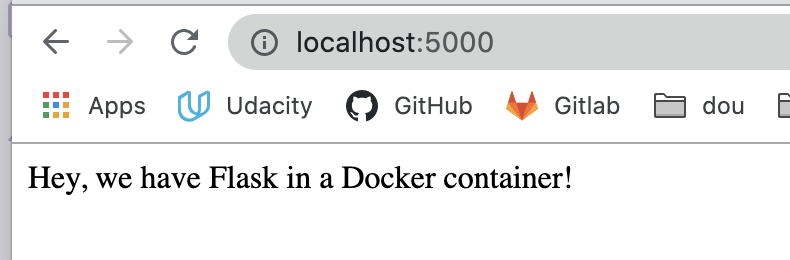

# Flask container

This is a simple repo for a starter flask app that has a container

To create the container use the command 

> docker build -t flask-tutorial:latest .

In this case, the name of the image will be flask-tutorial

To run it use:

> docker container run -p 5000:5000 flask-tutorial

And then visit localhost:5000

